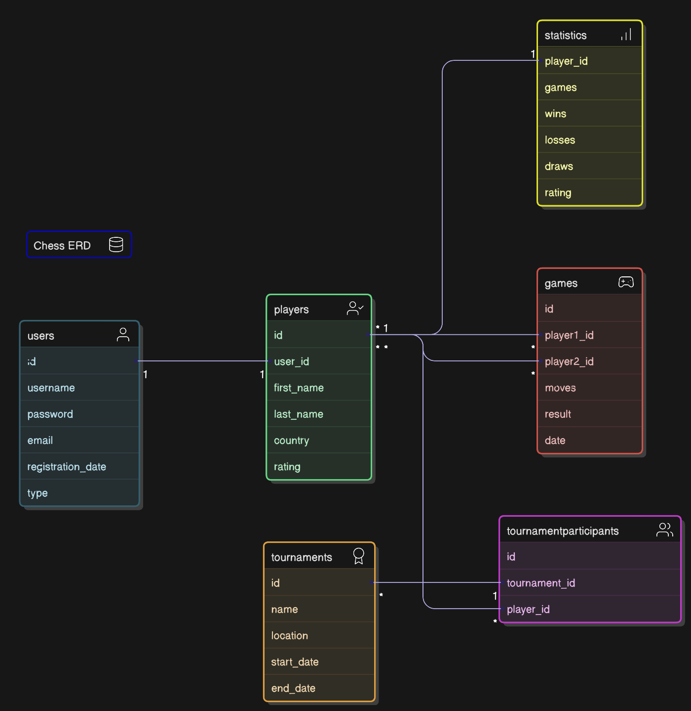

# Design Document

Danita Lamptey

Video overview: <https://youtu.be/H2bM19teFm4>

## Scope

* The purpose of this database is to manage and retrieve detailed information about chess players, their games, partipation in tournaments and statistics. As such, included in the database's scope is:

* Users, which includes basic identifying information.
* Players, which includes information about the players such as first_name.
* Games, which focuses on things like moves and results.
* Tournaments, which focuses on  where the game took place which can also be virtual
* Tournament_participants this shows how multiple players can participate in multipate tournaments
* Statistics which focuses on players performers generated by the players and games

* Out of scope are elements like detailed game analysis tools, financial transactions and user authentications.

## Functional Requirements

This database should support the following activities:
* CRUD operations for users, players, games and tournaments.
* Be able to associate multiple players with a tournament through tournament participation records.
* Generate and update statistics for players such as total games played.

* What's beyond the scope of what a user should be able to do with your database?
Note that in this database , real- time game analysis will not be provided.

## Representation
Entities are captured in SQLite tables with the following schema

### Entities

The database includes the following entities:

### Users

The `users` table includes:

* `id`, which specifies the `UNIQUE` ID for the user as an `INTEGER`. This column thus has the `PRIMARY KEY` constraint applied.

* `username`, which specifies the user's username. `TEXT` is used as it is appropriate for character fields. A `UNIQUE` constraint ensures no two users have the same username.

* `passwords`, which is the user's password is hashed for security reasons and uses the type `TEXT` to allow for non-numeric characters.

* `emails` , which specifies the user's email is also kept distinct with the `UNIQUE` keyword just like `username`.

* `type` provides room for non-registered users , who are referred to as `guest` in this database. `DAFAULT` classifies all users as `regular` unless otherwise specified.

All columns are required and hence have the `NOT NULL` constraint applied where a `PRIMARY KEY` or `FOREIGN KEY` constraint is not.

### Players

The `players` table includes:

* `id`, which specifies the `UNIQUE` ID for the player as an `INTEGER`. This column thus has the `PRIMARY KEY` constraint applied.

* `user_id`, which specifies the `UNIQUE` ID for the player as an `INTEGER`. This column thus has the `FOREIGN KEY` constraint applied, referencing the `id` column in the `users` table to ensure data integrity.

* `first_name`, which specifies the player's first name as `TEXT`, given `TEXT` is appropriate for name fields.

* `last_name`, which specifies the player's last name. `TEXT` is used for the same reason as `first_name`.

* `country`, which specifies the player's birth country. `TEXT` is used for the same reason as `first_name`.

* `rating`, which specifies the players rating. `INTEGER` is used to caputure the numeric representation.

All columns are required and hence have the `NOT NULL` constraint applied where a `PRIMARY KEY` or `FOREIGN KEY` constraint is not.

### Games

The `games` table includes:

* `id`, which specifies the `UNIQUE` ID for the user as an `INTEGER`. This column thus has the `PRIMARY KEY` constraint applied.

* `player1_id`, which is an `INTEGER` representing the ID of the first player in the game. It is also a  `FOREIGN KEY` that references the id column in the players table to ensure data integrity.

* `player2_id`, which is an `INTEGER` representing the ID of the second player in the game. It is also a `FOREIGN KEY` referencing the id column in the players table.

* `moves`, which is of type `TEXT` and stores the sequence of moves made in the game. This allows for storing the move history for analysis or replay purposes.

* `result`, which is of type `TEXT` and specifies the outcome of the game. It is constrained using a `CHECK` to accept only values `win`, `loss`, or `draw`.

* `date`, which is of type `DATETIME` and records the date the game was played.

All columns are required and hence have the `NOT NULL` constraint applied where a `PRIMARY KEY` or `FOREIGN KEY` constraint is not.

# Tournaments

The `tournaments` table includes:

* `id`, which serves as the `UNIQUE` identifier for each tournament as an `INTEGER` and acts as the `PRIMARY KEY.`

* `name`, which is a `TEXT` field representing the name of the tournament.

* `location`, which is a TEXT field specifying where the tournament takes place. This can represent physical locations or denote that the tournament is virtual.

* `start_date`, which is of type `DATETIME` and records the starting date and time of the tournament, with a default value of the current timestamp.

* `end_date`, which is also of type `DATETIME` and stores the ending date and time of the tournament, defaulting to the current timestamp.

All columns are required and hence have the `NOT NULL` constraint applied where a `PRIMARY KEY` or `FOREIGN KEY` constraint is not.

### Tournament_participants

The `tournament_participants` table includes:

* `id`, which serves as a `UNIQUE` identifier for each record in the table as an INTEGER and acts as the PRIMARY KEY.
* `tournament_id`, which is an `INTEGER` referring to the id of the tournament in which the player participates. It is also a  `FOREIGN KEY` that references the id column in the tournaments table.

* `player_id`, which is an `INTEGER` that specifies the id of the participating player. This column is also `FOREIGN KEY` referencing the id column in the players table.

All columns in the `tournament_partipants` table are required, and hence should have the `NOT NULL` constraint applied. No other constraints are necessary.

### Statistics
The `statistics` table includes:

* `player_id`, which is an `INTEGER` serving as the `UNIQUE` identifier for each player's statistics record and acts as the `PRIMARY KEY`. It is also a `FOREIGN KEY` referencing the id column in the players table to ensure data consistency.

* `games`, which is an `INTEGER` indicating the total number of games the player has participated in.

* `wins`, which is an `INTEGER` recording the number of games won by the player.

* `losses`, which is an `INTEGER` counting the number of games lost by the player.

* `draws`, which is an `INTEGER` representing the number of games that ended in a draw.

All columns in the `statistics` table are required, and hence should have the `NOT NULL` constraint applied. No other constraints are necessary.

### Relationships

The below entity relationship diagram describes the relationships among the entities in the database.

As detailed by the diagram:

* Users and Players: Each user is associated with zero or one player profile. A player may exist without an associated user (i.e a guest) or have a corresponding user account if registered. Users who play games are always represented as players.

* Players and Games: A player can participate in zero or many games as either player1 or player2. A game always involves exactly two players, representing the participants.

* Players and Tournaments: A player can participate in zero or many tournaments, while a tournament can have zero or many players. This many-to-many relationship is managed through the tournament_participants junction table, linking players to tournaments.

* Tournaments and Tournament Participants: Each tournament can have zero or many participants (players). Each entry in the tournament_participants table associates one player with one tournament.

* Players and Statistics: Each player has one and only one set of statistics, detailing their performance metrics, such as wins, losses, and draws. There is no case where a player exists without an associated set of statistics.

## Optimizations

* `player1_id` and `player2_id` columns in the games table to speed up the identification of games by player.

* Similarly, it is also common practice to view all players participating in a particular tournament. As such, an index is created on the `tournament_id` and `player_id` columns in the `tournament_participants` table to facilitate quick lookups of tournament participants.

 * Additionally, frequent access to player performance data is supported by an index on the `player_id` column in the statistics table to optimize queries involving player statistics.

## Limitations

* Limited Guest Player Tracking: The database allows guest players with no user account, but it lacks a mechanism to track their history or performance across multiple sessions, limiting the ability to offer personalized experiences or track guest activity over time.
